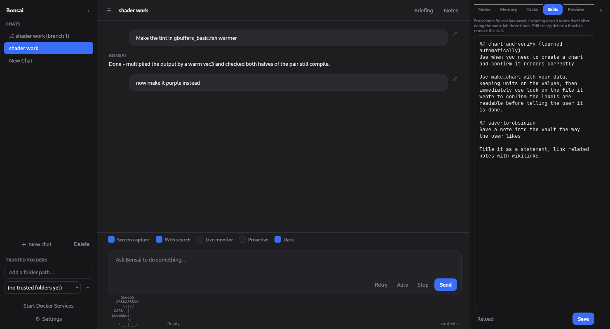
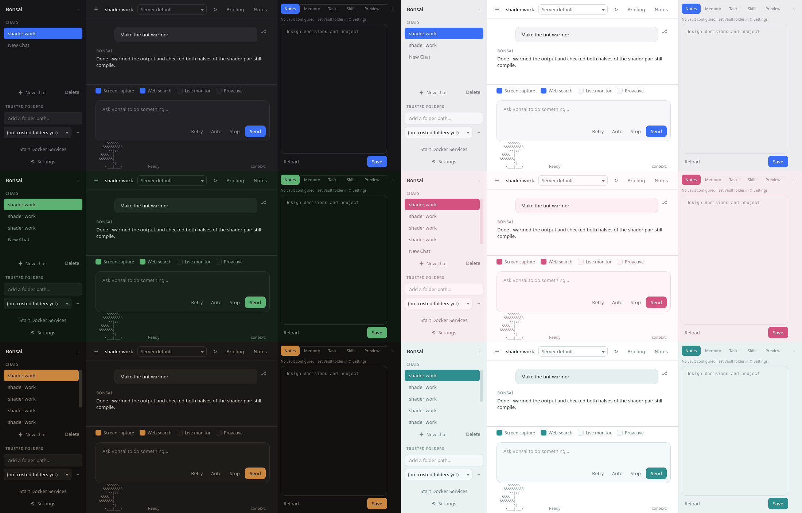
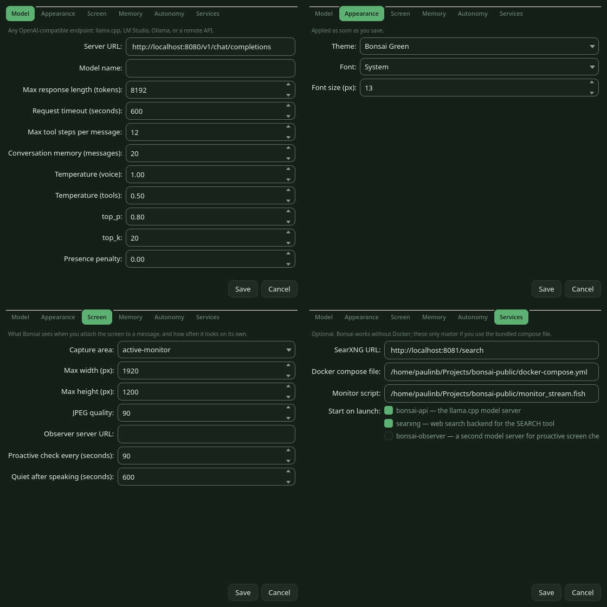

# Bonsai

A local desktop AI assistant that watches your screen, works on your files, and gets
more useful the longer you use it. It talks to any OpenAI-compatible endpoint
(llama.cpp, LM Studio, Ollama), so the model stays on your machine if you want it to.

It is a single PyQt6 app. No account, no telemetry, no cloud.



## What it does

- **Sees your screen.** Attach the current window or monitor to any message, or let it
  watch periodically and speak up on its own.
- **Acts on your machine.** Reads, writes and edits files, runs commands in a
  bubblewrap sandbox, opens programs, downloads things, searches the web through your
  own SearXNG.
- **Makes things.** Charts, PDFs, and images, drawn with Qt. There is nothing to
  install and nothing to fail.
- **Checks its own work.** It can *look* at what it made (a chart, a page of a PDF, a
  game window it just launched) and see whether it came out right.
- **Knows what it would break.** Every write and edit is parsed. Rename a function or
  change its parameters and it tells you which files still call the old one, before you
  find out the hard way.
- **Lets you take it back.** Edit anything you sent and ask again, or branch the
  conversation at any point. Both fork rather than overwrite, so the wording you used
  and the answer it gave stay in the sidebar to compare against.
- **Remembers.** Facts about you, notes in your Obsidian vault, earlier conversations,
  and procedures it writes for itself after doing the same job three times.
- **Briefs you.** Gathers what's new in the things you follow before you ask: news,
  videos, images or ordinary web writing, over whatever window you choose, and by
  default skipping anything a previous briefing already showed you.

## Why it is built the way it is

A local model will tell you it wrote a file it never wrote. It will mark a task done
against nothing. It will paste text shaped exactly like tool output and invent the
contents of three files that do not exist. Every attempt to fix this by asking more
firmly in the system prompt got gamed.

So Bonsai does not ask. It checks:

- Completing a task requires naming a file that exists, is more than a stub, **and
  parses**.
- Claims about actions are compared against what actually ran, and contradictions are
  flagged in the transcript.
- Repeated identical calls are refused; runaway loops are cut off.
- Text imitating tool output is stripped from replies, and you are told it was invented.

If you contribute, that is the grain to work with. See [CONTRIBUTING.md](CONTRIBUTING.md).

## Requirements

- Python 3.10+
- An OpenAI-compatible model server. A **vision** model is recommended, since screen
  watching is the premise.

It runs on Linux, Windows and macOS. What differs between them:

| | Linux (X11) | Linux (Wayland) | Windows | macOS |
|---|---|---|---|---|
| Screen capture | Qt | needs `grim` | Qt | Qt |
| Command sandbox | `bubblewrap` | `bubblewrap` | **none** | **none** |
| Opening files and apps | `xdg-open` | `xdg-open` | `start` | `open` |

Wayland forbids a client from reading the screen without the compositor's consent,
which is why `grim` is needed there and nowhere else. Where no sandbox exists, Bonsai
does not pretend: every command result says `(NOT sandboxed)` so you know what you are
approving.

> **Windows and macOS are untested.** They are implemented and unit-tested (the
> platform branches are exercised by forcing the platform flags), but nobody has yet
> run Bonsai on either. Expect rough edges, especially around screen capture, and
> please open an issue if you hit one. Linux is what it is developed and used on.

## Install

```bash
git clone https://github.com/Paulin-B/bonsai.git
cd bonsai
pip install -e ".[all]"
bonsai
```

On Windows, the same commands work in PowerShell once Python is installed. Screen
capture and launching programs need nothing extra there; the command sandbox is not
available (see the table above).

Or without installing:

```bash
pip install -r requirements.txt
python -m bonsai
```

## Point it at a model

Open **⚙ Settings → Model** and set **Server URL**. Some common ones:

| Server | URL |
|---|---|
| llama.cpp | `http://localhost:8080/v1/chat/completions` |
| LM Studio | `http://localhost:1234/v1/chat/completions` |
| Ollama | `http://localhost:11434/v1/chat/completions` |

The **picker in the header** switches between servers without restarting anything. It
takes effect on your next message, and the conversation carries on.

This matters because llama.cpp serves one model per process and ignores the model name
in a request, so swapping models there means swapping servers. Set up as many as you
like in Settings → Model, one per line:

```
3060 (always on) | http://localhost:8085/v1/chat/completions |  | ~/ai/small.yml
3080 Ti (faster) | http://localhost:8087/v1/chat/completions |  | ~/ai/fast.yml
Ollama           | http://localhost:11434/v1/chat/completions | qwen3:32b
```

The third field names a model, for servers that load on demand. The fourth names the
compose file that starts that server, so the Docker button follows whichever one you
are using.

Every server is listed whether or not it is running, so one being switched off never
hides the entry that would let you pick another. A server that loads models on demand
(LM Studio, Ollama) also gets a row per model it reports.

There is a `docker-compose.example.yml` if you want llama.cpp and SearXNG set up for
you. Copy it to `docker-compose.yml` and edit the model path.

## Themes

Six palettes and six font stacks, under **⚙ Settings → Appearance**, applied as soon as
you save. Light and dark are themes like any other, so there is no separate switch to
disagree with your choice.



*Midnight · Paper · Bonsai Green · Cherry Blossom · Sumi Ink · Sea Glass*

Settings are grouped rather than stacked in one long list, and follow the theme too,
including the spin and dropdown arrows. Qt otherwise draws those in a system colour no
palette reaches.



Every palette shares the same keys, so adding one is a dict in
[`bonsai/theme.py`](bonsai/theme.py) and nothing else. There is a test that holds each
one to a contrast floor (body text at 7:1, muted text and anything on the accent at
3:1), so a new theme cannot ship unreadable.

## First things to do

1. **Add a trusted folder** in the sidebar. File operations there skip the permission
   prompt; everywhere else asks first.
2. **Set a vault path** in Settings if you use Obsidian, and notes become markdown files
   Obsidian reads directly. Leave it blank and notes stay in JSON.
3. **Talk to it.** Memory, skills and project notes fill themselves in as you go.

## Where your data lives

Everything is plain JSON under `~/.local/share/`, safe to read, edit or delete:

```
bonsai_settings.json       app settings, including theme and font
bonsai_character.json      who Bonsai is - edit core_traits to change its personality
bonsai_memory.json         what it believes about you
bonsai_skills.json         saved procedures, including ones it wrote itself
bonsai_patterns.json       shapes of work it has noticed repeating
bonsai_briefing_seen.json  stories a briefing has already shown you
bonsai_projects.json       per-project file ledger and notes
bonsai_chats/              one file per conversation
```

Set `BONSAI_DATA_DIR` to keep separate profiles.

The Notes, Memory, Tasks and Skills tabs let you edit all of it in the app. If it
believes something wrong about you, fix the line.

## Safety

- `sudo`, `su`, `rm`, `dd`, `systemctl`, `curl` and friends are refused outright, as
  arguments to other programs too, so `kitty -e rm -rf ~` does not get through.
- Commands run under bubblewrap where available: only the working folder is writable,
  credential directories are masked with tmpfs, and there is no network.
- Paths matching credentials (`.ssh`, `.gnupg`, `.aws/credentials`, tokens, browser
  cookies) are refused for reading and writing.
- Opening a desktop program runs **outside** the sandbox and always asks first.

None of this makes it safe to point at a hostile model. It makes it safe enough to
point at your own project folder.

## Tests

```bash
QT_QPA_PLATFORM=offscreen python3 tests/run_all.py
```

1,560 checks, no model server required. They run against a temporary data
directory, so a test run cannot touch your own settings, memory or chats.

## Credits

Built by [Paulin-B](https://github.com/Paulin-B), who designed it, decided what it
should do, and found most of the bugs by using it.

A large share of the code was written by **Claude** (Anthropic) through
[Claude Code](https://claude.com/claude-code), working from that direction. The
principle the codebase is organised around, that the app should check the model's
claims rather than trust them, came out of watching a local model fabricate completed
work often enough that better prompt wording was clearly never going to be the answer.

Contributions are welcome. See [CONTRIBUTING.md](CONTRIBUTING.md).

## Licence

MIT.
